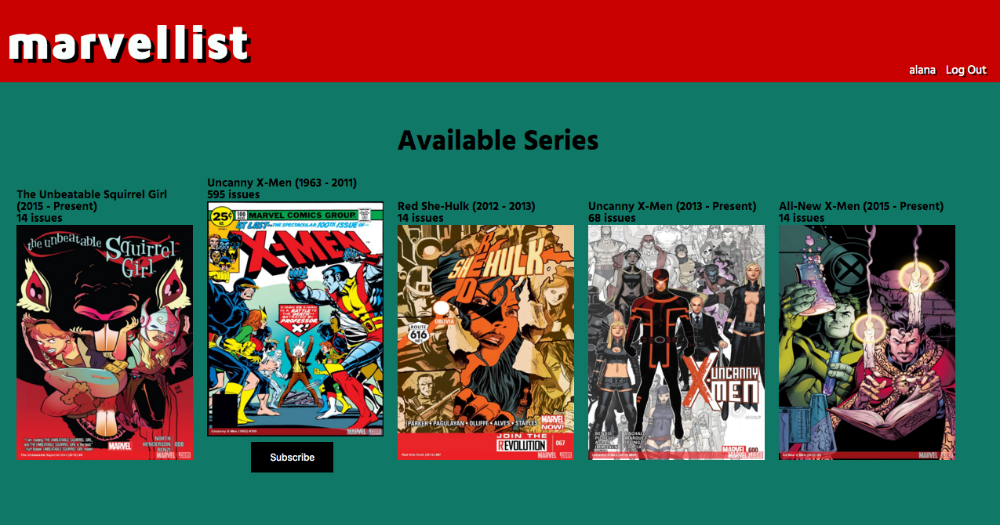

# marvellist

##Description
I am a big fan of comic books, and I am thrilled with my Marvel Unlimited subscription, except that it is not very good at letting me find specific titles or at keeping track of where I'm at in my reading order. Building an app to help me and other readers manage our comic consumption is something I've been wanting to do for a long time. Marvellist started out as a web app that I built in 2 days as my "beautiful, meaningful" project at Dev Bootcamp Chicago. I used a Sinatra framework and the Marvel API.

I am currently in the process of reworking this whole app to make it more functional. Going forward I'll be using Rails instead of Sinatra and I am considering using a front-end JS framework (React or Angular) to improve user experience.

##Screenshots

